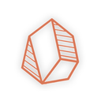
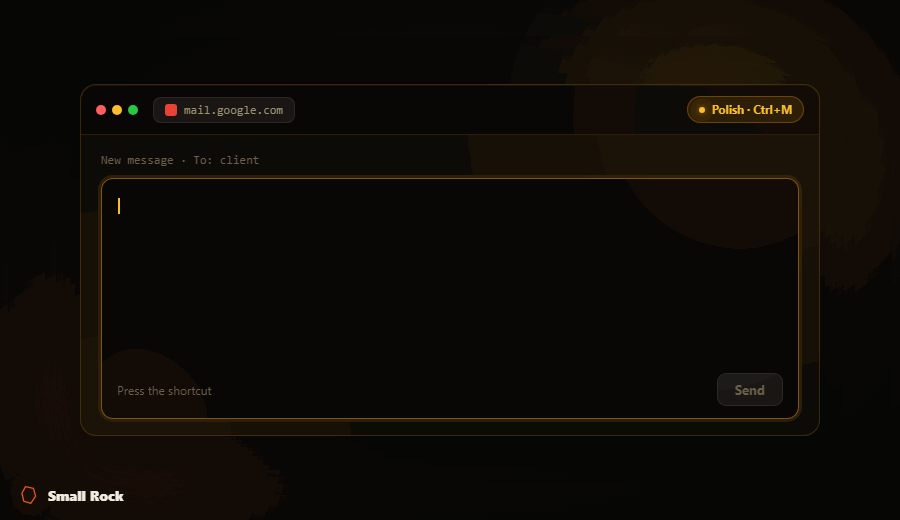

<div align="center">
  

  <h1>Small Rock v2</h1>

  <p><strong>Make everyone a prompt master.</strong></p>

  <p>
    Write a rough prompt anywhere, press <kbd>Ctrl</kbd>+<kbd>M</kbd>, and Small Rock
    instantly rewrites it into a structured, professional prompt — in place.
    Tap once for Quick, twice for Technical, three times for Planning.
  </p>

  <p>
    <a href="#-browser-extension">Browser Extension</a> ·
    <a href="#-windows-desktop-app">Windows App</a> ·
    <a href="#-configuration">Configuration</a> ·
    <a href="SECURITY.md">Security</a> ·
    <a href="LICENSE">MIT License</a>
  </p>

  <p>
    
  </p>
</div>

---

## What it does

You type:

> help me write a business plan for a startup in fintech

You press **Ctrl+M**. It becomes:

> **ROLE:** Senior business strategist with fintech expertise
> **OBJECTIVE:** Develop a structured business plan for an early-stage fintech startup
> **CONTEXT:** Pre-seed/seed stage; document for investors and advisors
> **REQUIREMENTS:** Problem, solution, market size, business model, competition, GTM, team, financials, the ask
> **OUTPUT FORMAT:** Clear section headings, 2–3 paragraphs per section, no filler

Two products, one experience:

| | What it is | Works in |
|---|---|---|
| 🧩 **Browser Extension** | Manifest V3 extension | ChatGPT, Claude, Gemini, Grok, Perplexity, Copilot, Mistral, Poe, DeepSeek + more — 15 sites out of the box |
| 🪟 **Windows Desktop App** | Electron tray app | **Any** Windows app — Claude desktop, ChatGPT desktop, Notion, VS Code, email, anywhere you can type |

Both use **your own free Google Gemini API key**. Your text goes only to Google's Gemini API — no servers, no analytics, no telemetry.

---

## ✨ Multi-mode rewriting

The number of times you tap the shortcut selects the rewrite style:

| Taps | Mode | Best for |
|------|------|----------|
| **Ctrl+M ×1** | **Quick Prompt** | General prompts — adds role, objective, context, requirements, output format |
| **Ctrl+M ×2** | **Technical Deep Dive** | Engineering questions — system context, correctness criteria, edge cases, constraints |
| **Ctrl+M ×3** | **Planning Mode** | Turning ideas into plans — goals, scope, phases, risks, structured output |

Every mode's system prompt is **fully editable** in Settings. Make them yours.

---

## 🧩 Browser Extension

**→ Full guide: [extension/README.md](extension/README.md)**

Quick start:

```bash
cd extension
pnpm install
pnpm build
```

Then load `extension/dist/` as an unpacked extension at `chrome://extensions` (Developer mode → Load unpacked). Add your Gemini key in Settings, and press **Ctrl+M** in any supported chat box.

---

## 🪟 Windows Desktop App

**→ Full guide: [desktop/README.md](desktop/README.md)**

Quick start (run from source):

```bash
cd desktop
pnpm install
pnpm dev
```

Or build a distributable Windows app:

```bash
cd desktop
pnpm build:app          # compile main + renderer
pnpm pack:win           # produce dist/win-unpacked/smallrock-desktop.exe
```

Add your Gemini key in Settings, then press **Ctrl+M** in any Windows application.

> **Note on lifecycle:** Closing the window fully quits the app — the shortcut, keyboard host, and all processes stop. To use the shortcut again, relaunch. (This is a deliberate "closed = everything off" design; see [desktop/README.md](desktop/README.md#lifecycle).)

---

## 🔑 Get a free Gemini API key

1. Visit **<https://aistudio.google.com/apikey>**
2. Create an API key (free tier: Gemini 2.5 Flash — plenty for personal use)
3. Paste it into Small Rock's **Settings** in either product
4. Click **Save & Test** — you should see a sample rewrite

The key is stored locally only:
- **Extension:** `chrome.storage.local` (this browser only, never synced)
- **Desktop:** encrypted at rest with Windows DPAPI via Electron `safeStorage`

---

## ⚙️ Configuration

Both products share the same configuration model:

- **API key** — your Gemini key
- **Three modes** — each with an editable name and system prompt
- **Reset to default** — per mode, any time

Changes apply to the next rewrite immediately. No restart needed.

---

## 🏗️ Repository structure

```
smallrock-v2/
├── extension/              # Manifest V3 browser extension (Vite + React)
│   ├── public/            #   background.js, content.js, manifest.json (vanilla, copied verbatim)
│   ├── src/               #   popup + options React UI, shared WebGL background
│   └── README.md          #   → extension guide
├── desktop/               # Electron desktop companion (electron-vite + React)
│   ├── src/main/          #   main process: shortcut, keyboard host, Gemini, store, tray
│   ├── src/renderer/      #   settings + overlay React UI
│   ├── src/preload/       #   contextBridge IPC surface
│   └── README.md          #   → desktop guide
├── SECURITY.md            # Threat model, audit results, hardening
├── CONTRIBUTING.md
├── CHANGELOG.md
└── LICENSE                # MIT
```

---

## 🔒 Security & privacy

Small Rock is built privacy-first and was put through a full security audit. Headlines:

- **One network destination** — `generativelanguage.googleapis.com`. Nothing else.
- **No telemetry, no analytics, no auto-update phone-home.**
- **Desktop app:** API key encrypted at rest (DPAPI); renderer is sandboxed with `contextIsolation`, a strict CSP, and navigation lockdown; your text only ever travels through the OS clipboard, never into a shell command (no injection path); closing the app tears down every process, shortcut, and in-flight request.

Full details, threat model, and the audit findings: **[SECURITY.md](SECURITY.md)**.

---

## 🛠️ Tech stack

- **Vite** + **React 18** for all UI (popup, options, settings, overlay)
- **WebGL2** custom shader background — no Three.js, no CDN
- **Vanilla JS** for the extension service worker & content script (zero dependencies, MV3-safe)
- **Electron** + **electron-vite** + **electron-builder** for the desktop app
- **electron-store** + **safeStorage** for encrypted local config
- Google **Gemini 2.5 Flash** via SSE streaming

---

## 📋 Requirements

- **Node.js** 18+ and **pnpm** 9+
- A free **Google Gemini API key**
- Desktop app: **Windows 10/11**

---

## 📄 License

[MIT](LICENSE) © 2026 Rashed Atieh
